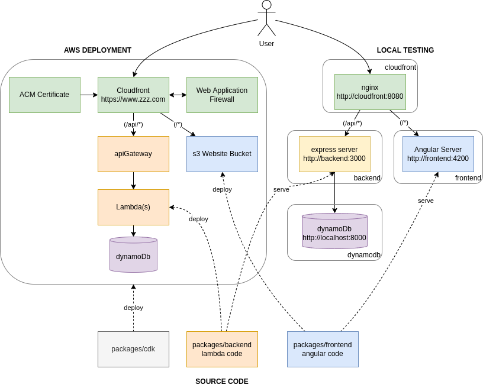

# cloudshiftstratgies / serverless-demo

This package demonstrates how to build, test and deploy an AWS serverless web application. 



## Requirements

- node 14+
- docker & docker compose (optional)

## First use

```shell
yarn install
docker-compose up
open http://localhost:8080
```

Create a dynamodb table in the local dynamodb instance
```shell
aws dynamodb create-table \
    --table-name serverless-demo \
    --attribute-definitions AttributeName=PK,AttributeType=S AttributeName=SK,AttributeType=S \
    --key-schema AttributeName=PK,KeyType=HASH AttributeName=SK,KeyType=RANGE \
    --provisioned-throughput ReadCapacityUnits=5,WriteCapacityUnits=5 \
    --endpoint-url http://localhost:8000 \
    --region local
```

## Packages
- [packages/frontend](packages/frontend) - an angular application (could be reactjs, vuejs or an html file)
- [packages/backend](packages/backend) - contains lambda functions
- [packages/cdk](packages/cdk) - contains cdk application that defines infrastructure
- [packages/dev-server](packages/dev-server) - an express server to emulate api gateway with lambda integrations

## Local testing

A [docker-compose.yaml](docker-compose.yaml) file is provided to run the following app containers
- `cloudfront` a nginx reverse proxy that emulates cloudfront by routing traffic to
   the `frontend` and `backend` origins on http://localhost:8080. The nginx config file is
   [packages/dev-server/nginx.conf](packages/dev-server/nginx.conf)
- `frontend` node container running the angular dev server from [packages/frontend](packages/frontend) in watch
   mode on http://localhost:4200. This emulates the static site being served from a s3 bucket website
- `backend` a node container running an express server for invoking lambdas on http://localhost:3000. This emulates
   an API gateway that invokes the lambda. The express configuration is at
   [packages/dev-server/dev-server.ts](packages/dev-server/dev-server.ts)
- `dynamodb` a local instance of aws dynamodb running on http://localhost:8000. This container used a docker volume
   to persist data between sessions. You can access the table with aws cli using the "--endpoint-url" flag like:
   `aws dynamodb list-tables --endpoint-url https://localhost:8080`

## Adding backend service
1. Create the lambda in [packages/frontend/src](packages/frontend/src)
2. Define an express route for lambda in [packages/dev-server/dev-server.ts](packages/dev-server/dev-server.ts)
3. Define the Lambda Function in [packages/cdk/lib/cdk-stack.ts](packages/cdk/lib/cdk-stack.ts) and create the appropriate
   api gateway resource/method
